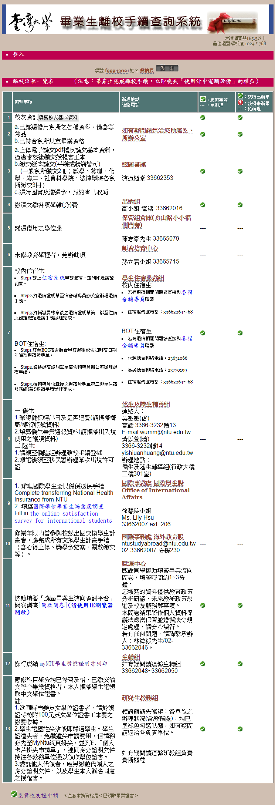

# 台大電子所ICS組碩班畢業之路

### 目錄
1. [簡介](#簡介)
1. [課程學分規定](#課程學分規定)
1. [申請畢業論文口試](#申請畢業論文口試)
1. [論文口試](#論文口試)
1. [離校手續](#離校手續)

### 簡介
* 本文主要根據「[台大電子所修業相關資訊](http://www.giee.ntu.edu.tw/portal/student_lect.php)」編訂而成。根據本文將所有步驟完成後，即可得到台大碩班畢業證書。
* 由於電子所規定每年可能略有不同，因此建議同學**在學期開學前再次確認本文是否需要更新**。
* 電子所最新相關文件[下載處](http://cc.ee.ntu.edu.tw/~giee/announce/download.htm)。

### 課程學分規定
* 碩士班應修最低畢業學分數為**24學分**，並應修習本組課程至少**12學分**，至於本組課程之定義則由指導教授就其專業領域之需求認定（此處學分數不包含**專題討論**、**專題研究**、**專題演講一**、**專題演講二**、**論文**及**外國語文**）。請注意大學部（U字頭以外）課程之學分不計入應修最低畢業學分數內。除了以上規定學分外，還需修習以下課程：

    | 課程編號  |  科目名稱  | 學分 |                    備  註                        |
    |:---------:|:----------:|:----:|--------------------------------------------------|
    | 943 M0010 |  碩士論文  |      | 學位考試成績佔畢業總成績之1/2                    |
    | 943 M0020 |  專題討論  |   0  | 已修畢(且通過)**四學期**以上者得免修             |
    | 943 M0030 |  專題研究  |   1  | 在學期間每學期必修（惟**畢業離校當學期得免修**） |
    | 943 M0040 | 專題演講一 |   1  | 必修一學期                                       |
    | 943 M0050 | 專題演講二 |   1  | 必修一學期                                       |

* 畢業學分中必須包含以下ICS組**核心課程**至少一門：

    | 課程編號  | 科目名稱                  | 學分 |
    |:---------:|:-------------------------:|:----:|
    | 921 U7060 | 類比積體電路              | 3    |
    | 943 U0240 | 電腦輔助積體電路系統設計  | 3    |
    
* 若曾經超修研究所課程的同學可填寫[抵免學分申請書](http://cc.ee.ntu.edu.tw/~giee/announce/download/c21_waive.doc)（另需上網登錄）。
    
* 碩士生依本校交換計畫申請出國交換，或申請到科技部、教育部之補助 出國進修，或經指導教授安排出國進行研究交流，達學期授課時數三分 之一（六週）者，得於出國前或返國後修習補足**專題討論**；達學期授 課時數三分之二（十二週）者，得免修當學期之**專題討論**，但需於返 國後該學期提出相當於**專題討論**課程免修習次數之書面或口頭心得報 告（由專題討論授課教師決定）。前述皆需提出申請，經指導教授及所長同意，並知會專題討論授課教師。

### 申請畢業論文口試
* 論文口試**申請期限**上學期為**11月30日**，下學期為**4月30日**。
* 預定畢業同學，選課時務必選**碩士論文**（課程編號為943 M0010）。若不幸忘了選，請洽詢研教組補選。
* 請於**申請期限內**、**口試前一個月**繳交下列資料至所辦，以辦理學位考試申請手續：
    1. [學位考試申請書](http://my.ntu.edu.tw/)（請至myNTU填寫列印，需**指導教授**簽章）
    2. [成績審核表](http://cc.ee.ntu.edu.tw/~giee/announce/download/g01_check_ms.doc)（需**指導教授**簽章）
    3. 歷年成績單（請自行至**研教組**申請）
    4. [口試委員名冊](http://cc.ee.ntu.edu.tw/~giee/announce/download/g02_committee_ms.doc)（最遲請提前於**口試前兩週**送交所辦）
* 如擬提前於學期中口試，並於學期中辦理離校手續者，需另附[提前畢業未修學分證明](http://gra103.aca.ntu.edu.tw/gra2007/gra/tienn/%E5%AD%B8%E4%BD%8D%E8%80%83%E8%A9%A6%E8%A1%A8%E5%86%8A/GRANOCREDIT.doc)，並請勿選專題討論及專題研究課程。（僅限確定要提前離校者）。若已選論文以外其他課程、又確定需提前離校者，需再另附[提前畢業註銷當學期修課申請書](http://gra103.aca.ntu.edu.tw/gra2007/gra/wu/delcurcou.doc)。

### 論文口試
* 口試前準備工作：
    1. 盡早邀約口委，詢問口委們可出席的時間並找出交集（推薦使用Google表單，可參考此[範本](https://goo.gl/forms/G67tAkNh5BzhgggY2)）
    2. 完成[碩士論文](https://github.com/mediaic/NTU_MS_Thesis)、
    並印製**平裝版**論文初稿給自己、老師與口委們（若口試有選擇公告的話需再多印一本給所辦）
    3. 製作口試投影片、並安排實驗室內部之口試Rehearsal
    4. 借口試教室
    5. 張羅當日口委之**飲料**與**點心**（陋習）
    6. **口試前一日**至電子所辦公室領取**口試委員審查費領據**
    
* 口試當日需攜帶：
    1. [口試委員審定書](https://github.com/mediaic/NTU_MS_Thesis/raw/master/doc/Approval.docx)（即論文簽名頁）
    2. [學位論文考試評分表](http://cc.ee.ntu.edu.tw/~giee/announce/download/g03_thesis%20grade.doc)（口試委員一人一份，包含指導教授，需要口委簽名）
    3. [學位考試紀錄表](http://cc.ee.ntu.edu.tw/~giee/announce/download/g03_oral%20record.doc)（一份，需要所有口委簽名）
    4. 口試委員審查費領據（需要口委簽名）
    5. 論文初稿
    6. 紙本投影片（口試委員一人一份，包含指導教授）
    7. 口委之**飲料**與**點心**（陋習）
    8. 一名幫忙做**口試紀錄**之同學（[口試紀錄範本](./doc/defense_record.docx)）

* 口試後收官：
    1. 依照口委建議修改論文
    2. 在老師將[**口試紀錄**](./doc/defense_record.docx)、[**口試委員審定書**](https://github.com/mediaic/NTU_PhD_Dissertation/raw/master/doc/Approval.docx)、[**學位論文考試評分表**](http://cc.ee.ntu.edu.tw/~giee/announce/download/g03_thesis%20grade.doc)、[**學位考試紀錄表**](http://cc.ee.ntu.edu.tw/~giee/announce/download/g03_oral%20record.doc)、**口試委員審查費領據**交給所辦、所辦確認沒問題後會請**所長**簽名，簽名完後的[**口試委員審定書**](https://github.com/mediaic/NTU_PhD_Dissertation/raw/master/doc/Approval.docx)需放在終版論文裡。
    3. 印製**紅底**燙金之**精裝版**論文終稿（圖書館需兩本，指導教授一本，實驗室一本，自己一本，因此最少需印**五本**）
    4. 繳交兩本畢業論文至台大總圖
    4. 完成[實驗室畢業生檢查清單](./doc/mediaic_check_list.docx)後交與老師
    5. 完成[電子所畢業生離校手續單](http://cc.ee.ntu.edu.tw/~giee/announce/download/g21_leave.doc)後交至所辦（其中指導教授之簽名需在完成上述第四項條件後才能獲得）
    
### 離校手續
* 前往myntu之[畢業生離校手續查詢](https://my.ntu.edu.tw/StudLeave/Login.aspx)確認所有**綠色勾勾**皆已亮起（除了第十三項之外，請見下圖）
* 學生證壓註失效後即可得到畢業證書，之後便可免費申請辦理**校友證**（可於[畢業生離校手續查詢](https://my.ntu.edu.tw/StudLeave/Login.aspx)最下方處點選申請）

    

